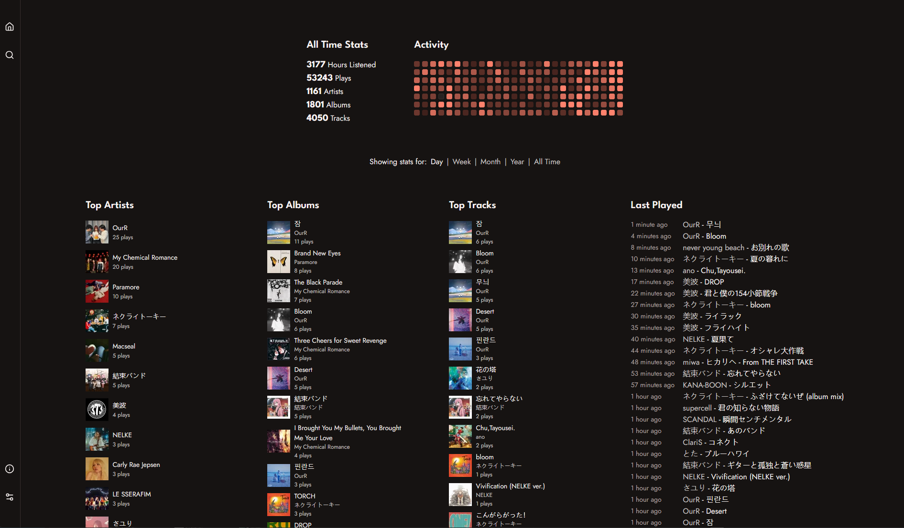
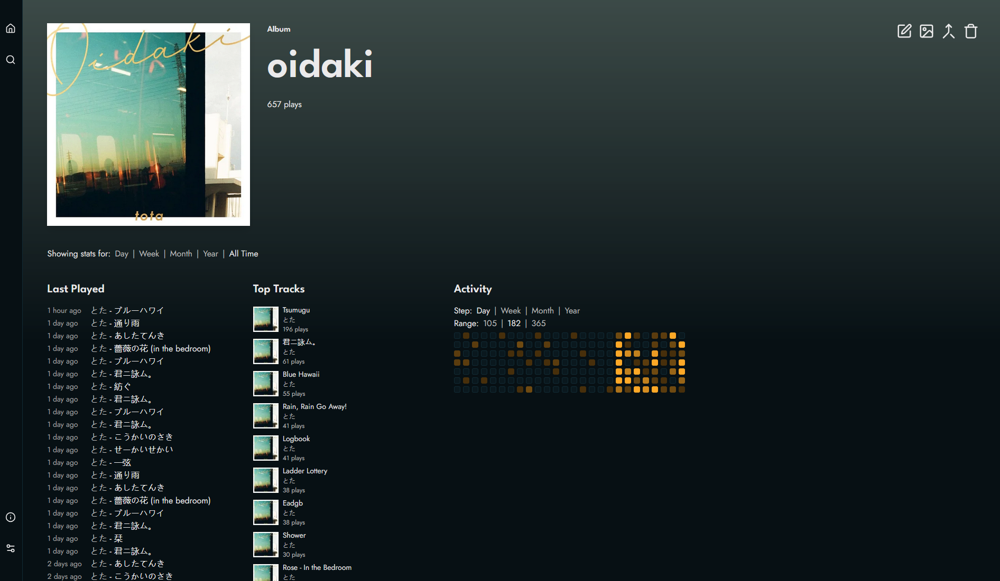
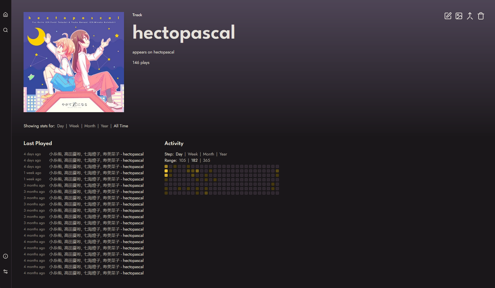

# Koito

Koito is a modern, themeable ListenBrainz-compatible scrobbler for self-hosters who want control over their data and insights into their listening habits. 
It supports relaying to other compatible scrobblers, so you can try it safely without replacing your current setup.

> This project is currently pre-release, and therefore you can expect rapid development and some bugs. If you don't want to replace your current scrobbler
with Koito quite yet, you can [set up a relay](https://koito.io/guides/scrobbler/#set-up-a-relay) from Koito to another ListenBrainz-compatible
scrobbler. This is what I've been doing for the entire development of this app and it hasn't failed me once. Or, you can always use something
like [multi-scrobbler](https://github.com/FoxxMD/multi-scrobbler).

## Features

- ⚡ More performant than similar software
- 🖌️ Sleek UI
- 🔁 Compatible with anything that scrobbles to ListenBrainz
- 🔌 Easy relay to your existing setup
- 📂 Import support for Maloja, ListenBrainz, LastFM, and Spotify

## Demo

You can view my public instance with my listening data at https://koito.mnrva.dev

## Screenshots





## Installation

See the [installation guide](https://koito.io/guides/installation/), or, if you just want to cut to the chase, use this docker compose file:

```yaml
services:
  koito:
    image: gabehf/koito:latest
    container_name: koito
    depends_on:
      - db
    environment:
      - KOITO_DATABASE_URL=postgres://postgres:secret_password@db:5432/koitodb
      - KOITO_ALLOWED_HOSTS=koito.example.com,192.168.0.100:4110
    ports:
      - "4110:4110"
    volumes:
      - ./koito-data:/etc/koito
    restart: unless-stopped

  db:
    image: postgres:16
    container_name: psql
    restart: unless-stopped
    environment:
      POSTGRES_DB: koitodb
      POSTGRES_USER: postgres
      POSTGRES_PASSWORD: secret_password
    volumes:
      - ./db-data:/var/lib/postgresql/data
```

Be sure to replace `secret_password` with a random password of your choice, and set `KOITO_ALLOWED_HOSTS` to include the domain name or IP address you will be accessing Koito 
from when using either of the Docker methods described above. You should also change the default username and password, if you didn't configure custom defaults.

## Importing Data

See the [data importing guide](https://koito.io/guides/importing/) in the docs.

## Full list of configuration options

See the [configuration reference](https://koito.io/reference/configuration/) in the docs.

## Contributing

There are currently some known issues that I am actively working on, in addition to adding new features. If you want to contribute (especially more and more robust testing) feel free to fork the repository and make a pull request with your changes.

If you have any feature ideas, open a GitHub issue to let me know. I'm sorting through ideas to decide which data visualizations and customization options to add next.

## Albums that fueled development + notes

More relevant here than any of my other projects...

Not just during development, you can see my complete listening data on my [live demo instance](https://koito.mnrva.dev).

#### Random notes

- I find it a little annoying when READMEs use emoji but everyone else is doing it so I felt like I had to...
- It's funny how you can see the days in my listening history when I was just working on this project because they have way more listens than other days.
- About 50% of the reason I built this was minor/not-so-minor greivances with Maloja. Could I have just contributed to Maloja? Maybe, but I like building stuff and I like Koito's UI a lot more anyways.