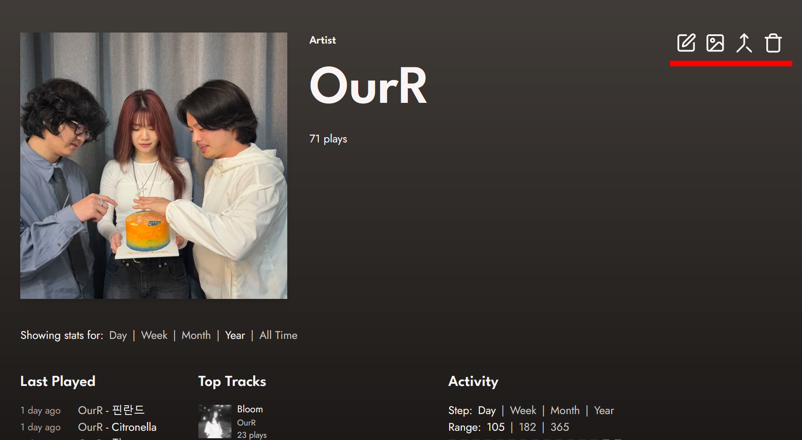
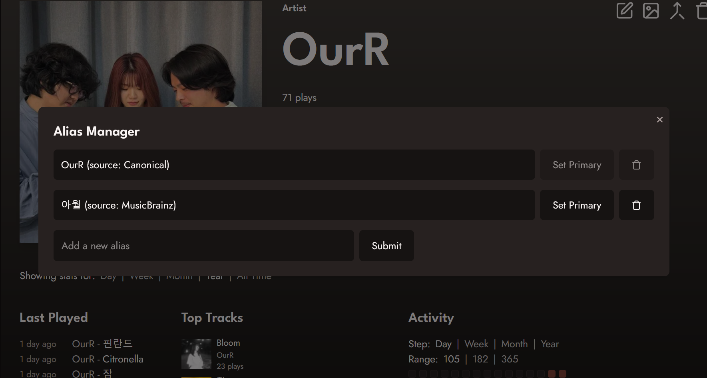
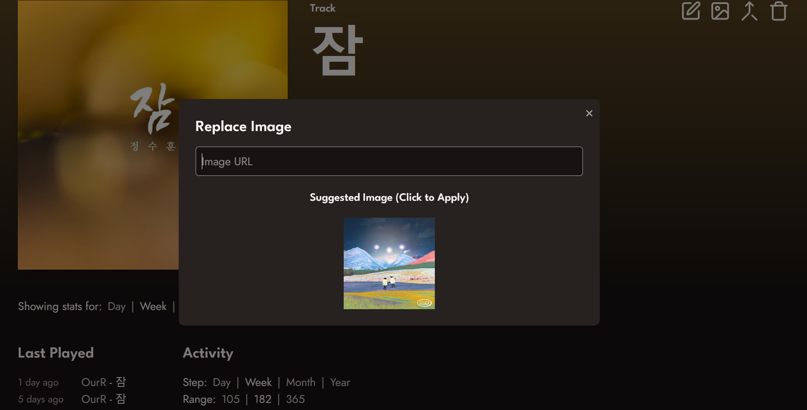
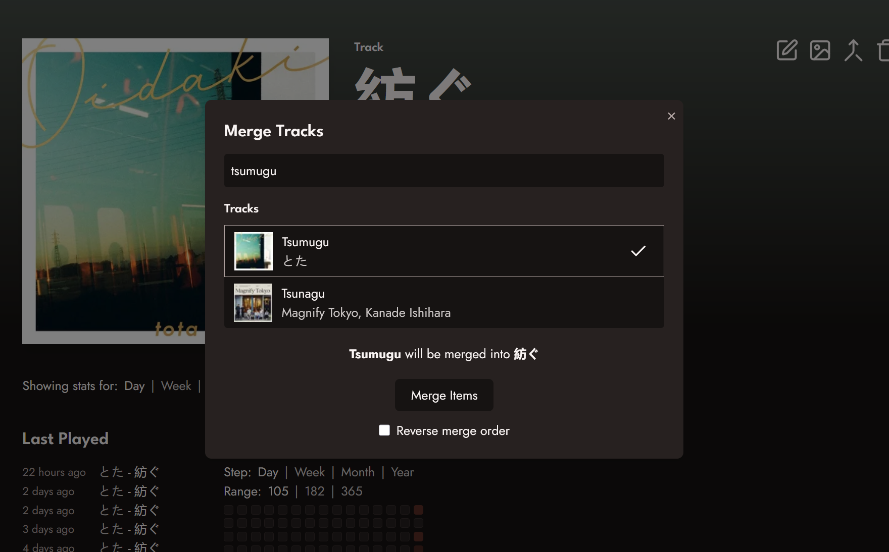

In order to start editing information on your Koito instance, you need to be logged in. See the [Setting up the Scrobber](/guides/scrobbler) guide if you need to log in for the first time.

Once logged in, navigate to the page of the item you want to edit. For this example, we will use the fantastic Korean dream pop group [OurR](https://www.youtube.com/watch?v=USHrBJRmF-o).
When you are logged in and on an artist, album, or track page, you will see the editing options on the top right.

#### Editing Aliases

The first option from the left is the Alias Manager. This is the option that lets us add known aliases for artists, albums, and tracks. Here, we can see that one alias
has already been filled in from MusicBrainz.

In the alias manager, we have three options: adding an alias, setting an alias as primary, and deleting an alias.

To add an alias, fill in the alias you want to add into the input. Then, click "submit". You will see the new alias appear in the list.

To set an alias as primary, click the "Set Primary" option next to the alias. Doing so will set that as the alias you see in the UI for the artist, album, or track.

To delete an alias, just click on the delete button.

Koito uses aliases for not only the UI, but also for matching artists, albums, and tracks submitted to the scrobbler, and for searching. So if you are like me and listen to a lot of
music from countries with non-latin script, adding aliases makes it easy to search for those items.

:::note
Koito uses MusicBrainz IDs to find additional aliases for artists and albums, if your music server provides them. Additional track aliases have to be added manually.
:::

#### Editing Images

The easiest way to replace an image is to simply drag an image file from your computer onto the page of the artist, album, or track you want to change the image for. This only works when you are logged in.

The other way to replace images is using the Replace Image option, which is the second editing option in the list. Here we will use OurR's 2021 single 잠.

Opening the Replace Image menu, we can either provide a link to the image we want to use, or, in this case, we can see a suggested image is provided. The image suggestions are provided by
Cover Art Archive, and only work for albums that have an associated MusicBrainz ID. Koito gets these IDs from your scrobbler, if its provides them. If not, you can always use a local image or provide a link.

#### Merging Items

Koito allows you to merge two items, which means that all of that item's children (for artists: albums, tracks and listens; for albums: tracks and listens; etc.) will be assigned to
a different item, and the old item will be removed.

For this example, we will use the incredible track [Tsumugu](https://www.youtube.com/watch?v=NDwqZIXOvKw) by the Japanese artist とた (Tota). Here we can see there two versions of the track,
one in Japanese and one romanized. I only want to keep the Japanese one. So, just navigate to the page for the Japanese-titled track, open the Merge Items menu (the third editing option), search for
the track we want to be merged, and click "Merge Items". A text will appear in the UI to clarify which track is the primary and which will be merged into it.

If we wanted to merge the other way, and only keep the romanized track, just click the "Reverse merge order" checkbox.

Once merged, we can see that all of the listen activity for Tsumugu has been asigned to 紡ぐ.

You can also search for items when merging by their ID using the format `id:1234`.

#### Deleting Items

To delete at item, just click the trash icon, which is the fourth and final icon in the editing options. Doing so will open a confirmation dialogue. Once confirmed, the item you delete, as well as all of its children
and listen activity, will be removed.