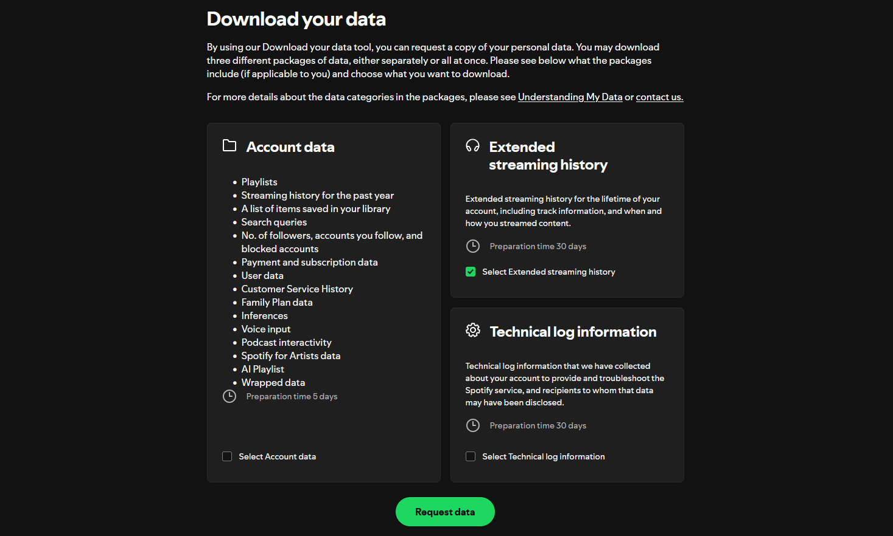

Koito currently supports the following sources to import data from:
- Spotify
- Maloja
- LastFM (using https://lastfm.ghan.nl/export/)
- ListenBrainz

:::note
ListenBrainz and LastFM imports can take a long time for large imports due to MusicBrainz requests being throttled at one per second. If you want
these imports to go faster, you can [disable MusicBrainz](/reference/configuration/#koito_disable_musicbrainz) in the config while running the importer. However, this
means that artist aliases will not be automatically fetched for imported artists. You can also use 
[your own MusicBrainz mirror](https://musicbrainz.org/doc/MusicBrainz_Server/Setup) and 
[disable MusicBrainz rate limiting](/reference/configuration/#koito_musicbrainz_url) in the config if you want imports to be faster.
:::

## Spotify

To get your data from Spotify, you first need to request your extended streaming history from [the Spotify privacy page](https://www.spotify.com/us/account/privacy/). 
The export could take up to 30 days, according to Spotify. Then, all you have to do is put the `.json` files from your data export into the
`import` folder in your config directory, and restart Koito. The data import will then start automatically.

Koito relies on file names to find files to import. If the files aren't being imported automatically, make sure they contain `Streaming_History_Audio` in the file name.

## Maloja

You can download your data from Maloja by clicking the `Export` button under Download Data on the `/admin_overview` page of your Maloja instance. Then,
put the resuling `.json` file into the `import` folder in your config directory, and restart Koito. The data import will then start automatically.

Koito relies on file names to find files to import. If the files aren't being imported automatically, make sure they contain `maloja` in the file name.

:::note
Maloja may have missing or inconsistent track duration information, which means that the 'Hours Listened' statistic may be incorrect after a Maloja import. However, track
durations will be filled in as you submit listens using the API.
:::

## LastFM

First, create an export file using [this tool from ghan.nl](https://lastfm.ghan.nl/export/) in JSON format. Then, place the resulting file into the `import` folder in your config directory.
Once you restart Koito, it will automatically detect the file as a Last FM import, and begin adding your listen activity immediately.

:::note
LastFM exports do not include track duration information, which means that the 'Hours Listened' statistic may be incorrect after importing. However, track
durations will be filled in as you submit listens using the API.
:::

## ListenBrainz

Create a ListenBrainz export file using [the export tool on the ListenBrainz website](https://listenbrainz.org/settings/export/). Then, place the resulting `.zip` file into the `import`
folder in your config directory. Once you restart Koito, your ListenBrainz activity will immediately start being imported.